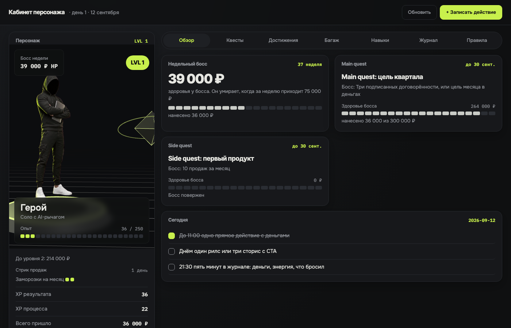

# life-rpg

Кабинет персонажа поверх markdown-файлов в Obsidian. Ты персонаж, уровень растёт только от денег, каждая неделя это босс, проекты это квесты, всё техническое лежит в рюкзаке и не даёт опыта.

Один HTML, один Node-сервер без зависимостей, данные в обычных `.md` файлах, которые открываются и правятся в Obsidian или любом редакторе.



## Что внутри

- **Персонаж.** 3D-сцена: герой на пьедестале, босс недели рядом. Запись денег запускает удар по боссу. Новый уровень меняет позу.
- **Два счётчика XP.** XP результата за поступившие деньги двигает уровень. XP процесса за действия, публикации и практику кормит стрик и недельного босса, уровень не двигает.
- **Квесты.** Один main quest на квартал, не больше двух side quest, остальное в рюкзаке. У каждого квеста босс с полосой здоровья.
- **Стрик** на действия к деньгам с двумя заморозками в месяц. Два пропуска подряд обнуляют.
- **Достижения, багаж, дерево навыков, журнал, правила.** Всё кликается, всё пишется в markdown.
- **Ночной скрипт** дописывает сессии Claude Code и коммиты сам.

## Почему так устроено

Правила выросли из ресёрча по геймификации, около 90 источников. Три вывода, которые определили дизайн:

1. Награда за отметку галочки подрывает интерес к делу, награда за внешне подтверждённый результат нет. Поэтому уровень растёт только от денег.
2. Новизна любой геймификации гаснет за 4-8 недель. Поэтому в правилах заложен тест на шестой неделе.
3. Ручной ввод умирает за 2-4 недели. Поэтому всё, что можно, считает ночной скрипт, руками остаётся пять минут вечером.

## Установка

Нужен Node 18 или новее.

```bash
git clone https://github.com/komzor5051/life-rpg.git
cd life-rpg
npm run init
npm start
```

`npm run init` спросит путь к хранилищу Obsidian, имя папки персонажа, имя, класс и цель дохода в месяц. Создаст папку с шаблонами и `rpg.config.json`. Без Obsidian тоже работает: укажи любую папку.

Открой http://localhost:4877.

Без вопросов:

```bash
node bin/init.mjs --vault ~/Obsidian/Vault --folder "Персонаж" --name Имя --class "Мой класс" --goal 300000 --yes
```

## Как играть

- **Утро.** Одно действие, ведущее к деньгам. Сделал его, нажми «Касание +1» на экране «Сегодня».
- **Продал.** Строка «Продал» вверху любого экрана: сумма, кому, Enter. Клавиша `p` ставит курсор в сумму. Пресеты под строкой берутся из поля `quick` во frontmatter («Консультация 3500, Гайд 990») или из последних продаж в журнале. Только пришедшие деньги или подписанная договорённость, это единственное, что растит уровень.
- **Пришли деньги.** Тип «Деньги», сумма, в источнике название продукта. Герой бьёт босса.
- **Вечер, пять минут.** Тип «Вечер»: энергия и одна строка «что бросил и почему».
- **Раз в неделю.** Отметить достижения, поднять уровень навыка по критерию, решить, что в рюкзак. Правила правятся только здесь.

## Свой герой

Положи два PNG на фоне маджента `#FF00FF` (две позы) в хранилище и укажи пути в `00 Персонаж.md`:

```yaml
hero: "[[_attachments/hero.png]]"
hero2: "[[_attachments/hero-2.png]]"
```

Фон вырезается в браузере. Такой рендер по фото делает любая image-модель: попроси «стилизованный 3D-персонаж для экрана выбора героя, полный рост, фон сплошной #FF00FF».

## Ночной автосбор

```bash
node scripts/nightly.mjs
node scripts/nightly.mjs 2026-01-15 --repos ~/proj1,~/proj2
```

Считает сессии Claude Code из `~/.claude/projects` и коммиты в указанных репозиториях, пишет строку `system` за вчера и сегодня. Список репозиториев можно положить в `rpg.config.json` полем `repos`. Повесь на cron или launchd на вечер.

Автозапуск сервера на macOS: скопируй `scripts/com.life-rpg.plist` в `~/Library/LaunchAgents/`, поправь путь к `server.mjs` внутри и выполни:

```bash
launchctl bootstrap gui/$(id -u) ~/Library/LaunchAgents/com.life-rpg.plist
```

В простое сервер ест около 40 МБ памяти и ноль процессора. 3D-сцена рисуется только пока вкладка на экране.

## Формат данных

| Файл | Что | Кто пишет |
|---|---|---|
| `00 Персонаж.md` | frontmatter: имя, класс, герой, цели, формула | ты |
| `Журнал.md` | строки `- [type:: money] [d:: 2026-01-15] [sum:: 14000] [src:: ...]` | кабинет, ночной скрипт, ты |
| `Квесты/*.md` | frontmatter `kind` main/side/backpack, `boss`, `deadline`, `target`, `match`; чекбоксы шагов | кабинет и ты |
| `Достижения.md` | чекбоксы с `[when:: ]` | кабинет |
| `Багаж.md` | `[earned:: ]`, `[last:: ]` | ты |
| `Знания.md` | `[lvl:: N]` по разделам и строка «Критерии:» | кабинет |
| `Фундамент.md` | правила, показываются во вкладке | ты |

Логика: 1 XP результата за 1 000 денег, уровень каждые `xp_per_level` XP, здоровье босса недели это `weekly_goal` минус деньги недели, side quest получает деньги по регулярному выражению `match` из поля `src`.

## API

Сервер отдаёт JSON и картинки, ими пользуется кабинет и любой внешний виджет (например, в menu bar).

| Эндпоинт | Что отдаёт |
|---|---|
| `GET /api/state` | сырое состояние: `cfg` (frontmatter персонажа), `journal`, `achievements`, `bag`, `skills`, `quests`, `today`, `rules`, ссылки на `avatar`, `hero`, `hero2` |
| `GET /api/summary` | посчитанная сводка, та же логика, что в кабинете: `name`, `class`, `level`, `xpIn`, `perLevel`, `xpResult`, `xpProcess`, `moneyAll`, `moneyMonth`, `moneyWeek`, `monthlyGoal`, `weeklyGoal`, `bossHp`, `bossDead`, `streak`, `freezesLeft`, `dayN`, `today {sale, content, day}`, `todayCounts {sale, content, system}`, `mainQuest {title, boss, progress, target}` или `null` |
| `GET /hero` | PNG героя как лежит в хранилище, с маджента-фоном |
| `GET /hero-thumb` | PNG героя высотой 320 px с вырезанным фоном. Вырезает `python3` с Pillow, результат кэшируется в системном tmp. Без Pillow отдаётся исходник |
| `POST /api/log` | дописать строку в `Журнал.md`. Тело JSON: `type` (money, sale, content, practice, day, system), `d` (по умолчанию сегодня), `sum`, `n`, `hours`, `energy`, `src` |

Остальные POST: `/api/log/delete` (`raw`), `/api/achievement` (`raw`, `on`), `/api/skill` (`name`, `lvl`), `/api/quest` (`file`, `patch`), `/api/quest/step` (`file`, `text`, `done`).

## Виджет в строке меню

SwiftBar-плагин показывает персонажа рядом с часами и даёт записывать действия без открытия кабинета.

1. Поставь [SwiftBar](https://github.com/swiftbar/SwiftBar): `brew install --cask swiftbar`. При первом запуске выбери папку плагинов, например `~/.swiftbar`.
2. Подключи плагин симлинком: `ln -s "$(pwd)/menubar/life-rpg.30s.sh" ~/.swiftbar/life-rpg.30s.sh`.
3. Сервер должен работать (см. автозапуск выше). Если порт другой, задай `LIFE_RPG_URL` в окружении SwiftBar.

В строке меню: `LVL 3 · 41 500 HP`, после 11:00 без касания добавляется «касание?». По клику открывается карточка: герой, уровень, опыт, стрик, босс недели, main quest, чек-лист дня. Карточка рисуется в PNG скриптом `menubar/render_card.py` (нужен Pillow: `python3 -m pip install pillow`), без Pillow плагин падает на текстовую версию.

Действия в меню: «Продал: сумма…» спрашивает сумму и источник через системный диалог, «Касание +1», «Публикация +1», «Закрыть день» (энергия и что бросил). Всё пишется в `Журнал.md`, кабинет подхватывает сам: он опрашивает сервер каждые 15 секунд и при возврате во вкладку.

## Стек

Node без зависимостей, один HTML, Three.js r128 лежит в `public/`. Шрифты Inter Tight, Onest и IBM Plex Mono подгружаются с Google Fonts, без интернета работает системный шрифт.

## Лицензия

MIT. Автор Влад Лямин, [t.me/lvmnaboutai](https://t.me/lvmnaboutai).
